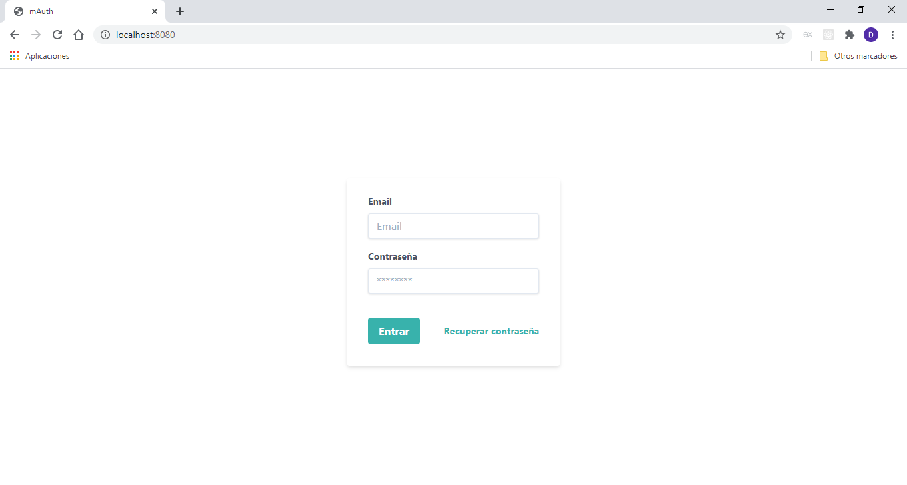

# mAuth

Simple autorización de usuarios con MongoDB. Se desarrolla con las siguientes fantasticas tecnologías:

* Node/Express
* MongoDB/Mongoose
* Handlebars
* Tailwind

#### De la caja:

* Autorizacion basada en cookies
* Mensajes flash
* Validación de formularios del lado del cliente y del servidor

#### Como arrancar

<pre><code>
  yarn
  yarn run app
</code></pre>

Es necesario crear el fichero <code>credentials.js</code> con el siguiente contenido:

<pre><code>
  module.exports = {
    cookieSecret: 'frase secreta',
    mongo: {
      development: {
        connectionString: 'mongodb://127.0.0.1/nombre_de_su_base_de_datos'
      },
      production: {
        connectionString: 'mongodb://127.0.0.1/nombre_de_su_base_de_datos'
      }
    }
  }
</code></pre>

#### Licensia:

Eres libre y tienes derecho de hacer todo lo que quieres.

#### Pantallas:

Login ->

Mensajes flash ->

Perfil de usuario ->
